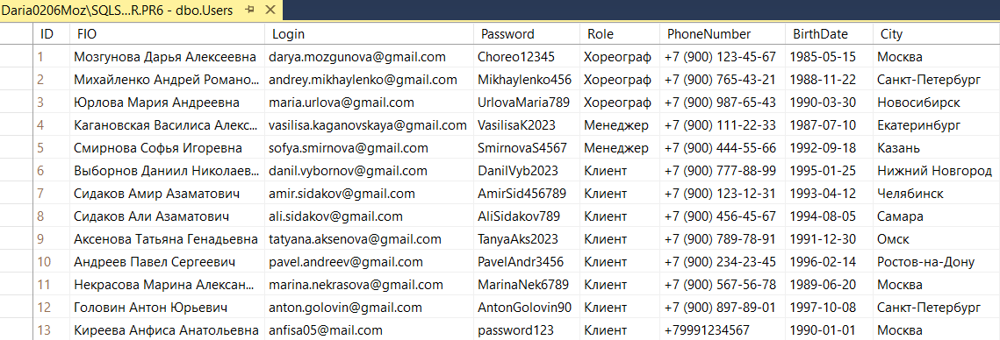
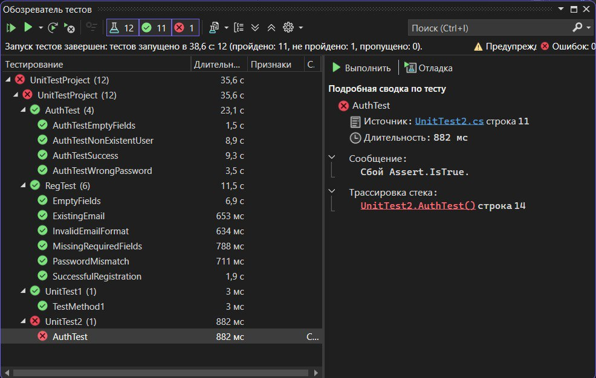

# Практическая работа №6 Создание автоматизированных Unit-тестов (Часть 2)

#### Cкриншот содержимого таблицы с пользователями из СУБД Microsoft SQL Server:

#### Cкриншот окна «Обозреватель тестов» 

#### Вывод о проведенном тестировании: 
Создала таблицу с информацией о пользователях, зарегестрированных в системе в СУБД Microsoft SQL Server. После чего подключила эту бд и таблицу к своему WPF-проекту и написала свои автотесты для страницы авторизации (AuthPage) и страницы регистрации в системе (RegPage). 
Все тесты прошли успешно, кроме одного "AuthTest" (из примера в самой практической работе). Неудачный он из-за того, что "Assert.IsTrue(page.Auth("test", "test"))" не может быть True, так как пользователя с такими данными не существует в системе, а мы утверждаемый что такой пользователь есть.

